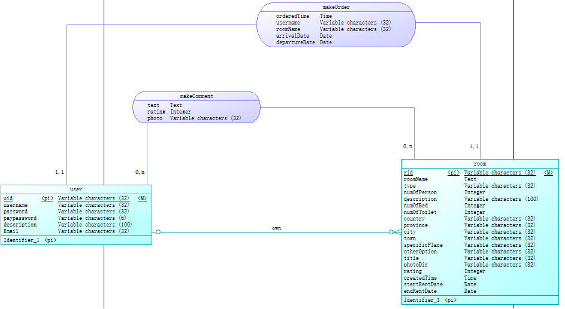

目录：    
- 一、[项目环境](#1)    
- 二、[项目构建和管理工具](#2)    
- 三、[技术选型](#3)    
- 四、[架构设计](#4)   
- 五、[模块划分与设计](#5)    
  - 系统整体模块图    
- 六、[数据库设计](#6)     
- 七、[路由设计](#7)    
- 八、[功能模型及用例设计](#8)    
- 九、[逻辑视图](#9)    
- 十、[物理视图](#10)    
- 十一、[技术备忘录](#11)    
- 十二、[设计技术](#12)    

### <h3 id="1">一、项目环境</h3>    
### <h3 id="2">二、项目构建和管理工具</h3>    
基于Diango的REST的diango-rest-framework进行开发。    
采用Github管理平台托管代码。
### <h3 id="3">三、技术选型</h3>    
基于Javascript+Diango+MySql的微信小程序。
### <h3 id="4">四、架构设计</h3>    

### <h3 id="5">五、模块划分与设计</h3>    
  - 系统整体模块图    
### <h3 id="6">六、数据库设计</h3>    
  - 数据库设计：    
    - 1.概念设计    
    
    - 2.数据库表结构设计   
     
### <h3 id="7">七、路由设计</h3>    
### <h3 id="8">八、功能模型及用例设计</h3>    
创建房间设计：    
    
完成房间订单：    

### <h3 id="9">九、逻辑视图</h3>    

### <h3 id="10">十、物理视图</h3>

### <h3 id="11">十一、技术备忘录</h3>    
### <h3 id="12">十二、设计技术</h3>
