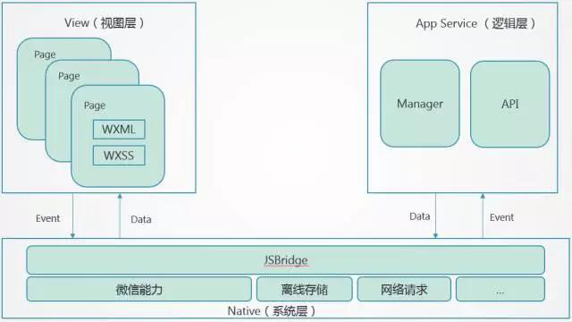
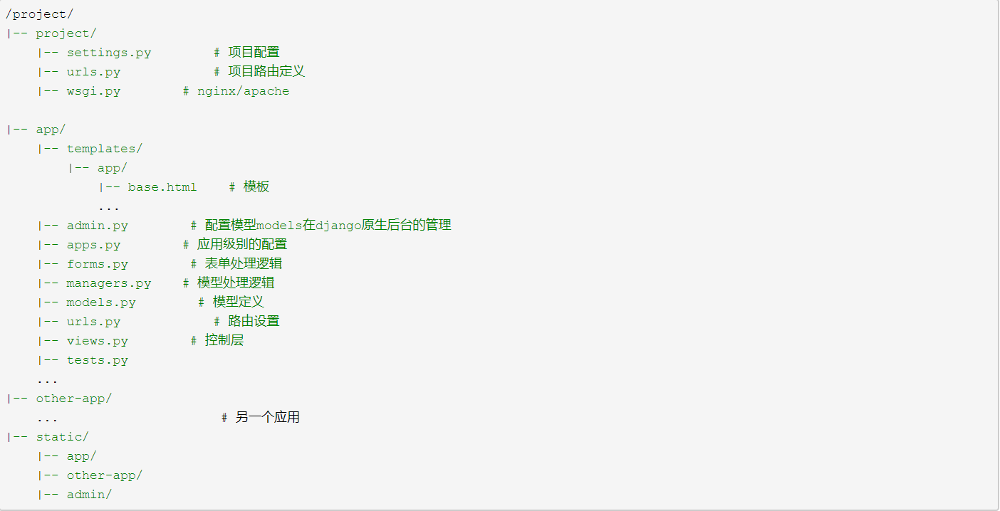
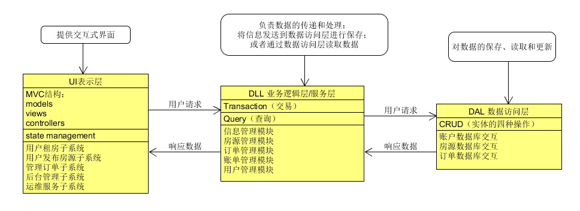
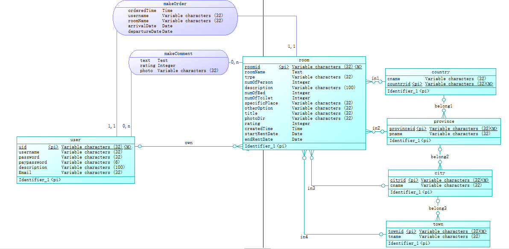
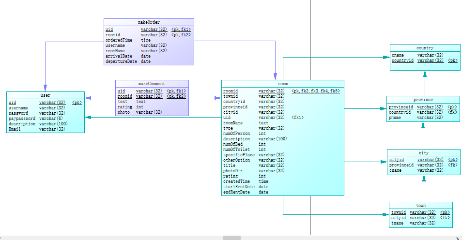
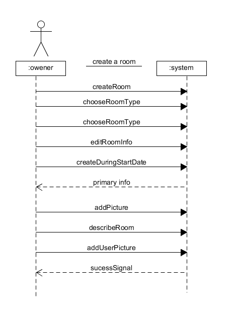
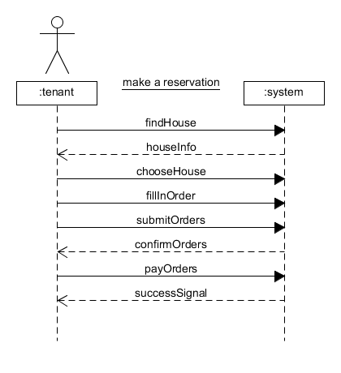
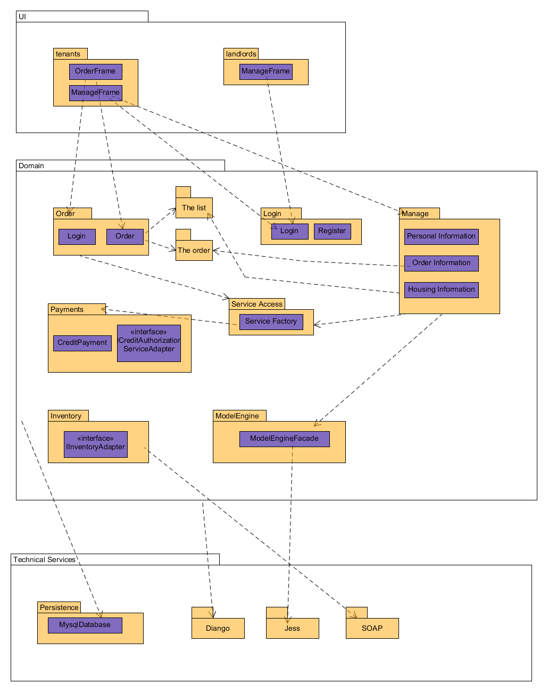
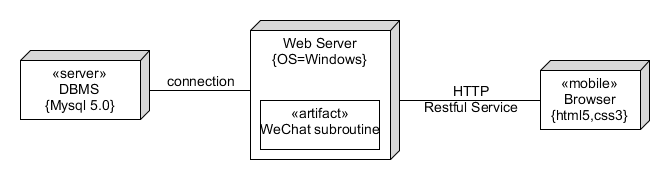

目录：    
- 一、[项目环境](#1)    
- 二、[项目构建和管理工具](#2)    
- 三、[技术选型](#3)    
- 四、[架构设计](#4)   
- 五、[模块划分与设计](#5)    
  - 系统整体模块图    
- 六、[数据库设计](#6)     
- 七、[路由设计](#7)    
- 八、[功能模型及用例设计](#8)    
- 九、[逻辑视图](#9)    
- 十、[物理视图](#10)    
- 十一、[技术备忘录](#11)    
    

### <h3 id="1">一、项目环境</h3>    
  - 数据库：MySql 5.0
  - 客户端：手机微信
### <h3 id="2">二、项目构建和管理工具</h3>    
基于Diango的REST的diango-rest-framework进行开发。    
采用Github管理平台托管代码。
### <h3 id="3">三、技术选型</h3>    
基于Diango+MySql的微信小程序开发。    
1. 微信小程序开发    
支持组件化开发和数据绑定，技术架构上清晰易懂。JS负责业务逻辑的实现，表现层由WXML和WXSS共同实现。对于开发者来说，降低了不少门槛。    
    
从上图可以看出，小程序借助JSBridge实现了对底层API接口的调用，所以在小程序开发里面，开发者不用太多考虑IOS，安卓的实现差异问题，只需要在上层的视图层和逻辑层进行开发即可。    

2. Django    
Django相较其他WEB框架的优势主要有：大而全，框架本身集成了ORM、模型绑定、模板引擎、缓存、session等诸多功能。    
  - 自带强大后台功能：django自带admin后台，几行代码就可以拥有一个完整的网站后台，轻松管理内容。    
  - 强大的数据库功能：用python的类继承，几行代码就可以拥有一个动态的数据库操作API，如果需要也能执行SQL语句。
  - URL design：Django的url模块设计的看似很复杂，都是使用正则表达式，但真正用到的都是很简单的正则，所以更加轻松的表达优美简洁的地址。    
一个成熟的Django项目结构大致如下：    

### <h3 id="4">四、架构设计</h3>    

### <h3 id="5">五、模块划分与设计</h3>    
  - 系统整体模块图    
### <h3 id="6">六、数据库设计</h3>    
  - 数据库设计：    
    - 1.概念设计    
    
    - 2.数据库表结构设计   
     
### <h3 id="7">七、路由设计</h3>    
### <h3 id="8">八、功能模型及用例设计</h3>    
创建房间设计：    
    
完成房间订单：    

### <h3 id="9">九、逻辑视图</h3>    

### <h3 id="10">十、物理视图</h3>

### <h3 id="11">十一、技术备忘录</h3>    
1.问题：如何获取用户当前所在城市
  
  解决方法：微信小程序接口只提供了获取当前用户所在位置的坐标，因此使用了腾讯地图提供的接口，以坐标为输入，然后就能从输出中获取用户所在的城市了。

2.问题：如何确定用户身份的唯一性
  
  解决方法：我们可以在后台自动生成一个唯一的id来标记用户的身份。但是由于我们采用微信小程序来实现，因此可以采用微信官方提供的openid来标记用户身份。我们在用户首次登录的时候，向微信官方发出请求获取用户的openid，然后保存在数据库中。之后用户的每一次登录，我们也请求一次openid，然后返回给前端，因此用户每一次的操作都可以使用openid来验证了。

3.问题：图片的上传和下载问题

  解决方法：由于无知，我们一开始采用了wx.request接口来进行操作。但图片的上传应该调用微信小程序的api——uploadFile来解决。最后整体的解决方案如下：用户上传图片，后台保存在服务器中。当用户请求图片时，后台返回一个图片地址，前端得到地址后，重新发出请求向服务器获取图片.
  
  缺陷：实际上，涉及到类似于图片这种文件的访问，我们需要另外搭建一个静态资源服务器，减轻当前服务器的压力。但由于种种原因，我们只能将两个服务器合二为一，这一点做得并不完善。
