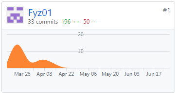

### 自我总结    
这门课是自己第一次小组合作完成一个项目。由于之前没有经验，所以在一开始的时候是十分迷茫的，不知道怎样去开始一个项目。    
光是在确定项目的讨论中就困难重重，用例分析的时候，大家也都很迷，对于到底什么才是用例理解的不是很透彻，每个人根据教材和老师上课讲的都有自己的理解。
但是最终还是在磕磕绊绊中讨论出了主要业务场景。    
在这个过程中，通过查资料，看教材，以及和组员沟通，再加上跟着老师上课的节奏，一点点的对整个项目的框架有了概念。    
由于组里有比较擅长写代码的组员，所以我就主要负责了文档撰写以及UI的设计。我觉得收获最大的还是在文档方面，通过这门课，了解了一个项目从初期到最终都需要哪些文档。    
每种文档的作用是什么，以及编写这些文档的具体要求。虽然最终成果还是不够好，但是至少有了深刻的体会。如果再接触到其他项目，可能就不会过于迷茫。    
另外，还有一点我觉得非常重要的就是团队沟通。团队合作真的是非常重要，虽然大家有分工，但是组员之间一定不能相互独立，组长一定要起到桥梁的作用，不仅自己要了解每个人的进度，    
而且要尽可能地与每个人沟通，让组员们大概清楚项目其他部分的进度，从而对自身计划进行修改，团队要作为一个整体不断推进，这样才是效率最高的，否则可能就会因为某个人的脱节而造成项目的总体滞后。    
总的来说，在这门课上收获很大，感谢老师的指导，感谢大神们分享的精彩博客!    

### PSP2.1统计表    

| PSP2.1          | Personal Software Process Stages | Time(%) |    
|-----------------|----------------------------------|---------|    
|**Planning**         | **计划**                              |    **8**    |    
|● Estimate         |   估计这个任务需要多长时间             |  8      |    
|**Develoment**       | **开发**                              |   **84**    |    
|● Analysis         |   需求分析（包括学习新技术）            |  10      |    
|● Design Spec      |   生成设计文档                        | 15      |    
|● Design Review    |   设计复审（和同事审核设计文档）         |   4    |    
|● Coding Standard  |   代码规范（为目前的开发制定规范）       |    4    |    
|● Design           |   具体设计                           |    8    |    
|● Coding           |   具体编码                           |    15   |    
|● Coding Review    |   代码复审                           |    8    |    
|● Test             |   测试（自我测试，修改代码，提交修改）    | 20      |    
|**Reporting**        | **报告**                               |  **8**    |    
|● Test Report      |   测试报告                           |    3    |    
|● Size Measurement |   计算工作量                         | 2       |    
|● Postmortem & Process Improvement Plan|   事后总结，并提出过程改进计划| 3|    

### GIT统计报告    

### 工作清单    
  - 产品特性文档    
  - 用例图    
  - 部分功能模型    
  - 软件设计文档    
  - 补充性规格说明    
  - UI设计    
  - 软件架构文档    
  - 会议记录    

### 个人博客    
[个人博客](https://blog.csdn.net/qq_40134052)

