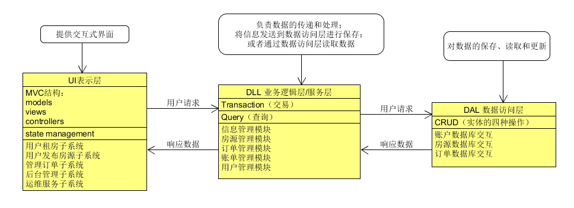

# 青年短租 后台部署文档

所用工具： Nginx + python3 django + sqlite3 db

---

## 一、部署架构图



---

## 二、部署流程

### 1. 服务器后台环境配置

#### 1.1 服务器系统环境

- windows 7

#### 1.2 Django 安装

- [官方参考链接](https://docs.djangoproject.com/en/1.11/intro/)

- [中文参考链接](http://www.runoob.com/django/django-install.html)


#### 1.3 Nginx 安装

- [官方参考链接](https://docs.docker.com/compose/install/)

- [中文参考链接](http://www.runoob.com/docker/docker-install-nginx.html)
- 
#### 1.4 sqlit3 安装

- [中文链接](http://www.runoob.com/sqlite/sqlite-installation.html)

### 2. 服务器程序配置运行

#### 2.1 拉取后台源代码

```bash
git clone git@github.com:WindyMen/BackEnd.git
```

#### 2.2 测试服务器运行状况

```bash

```

有获得以上响应则说明部署成功。
